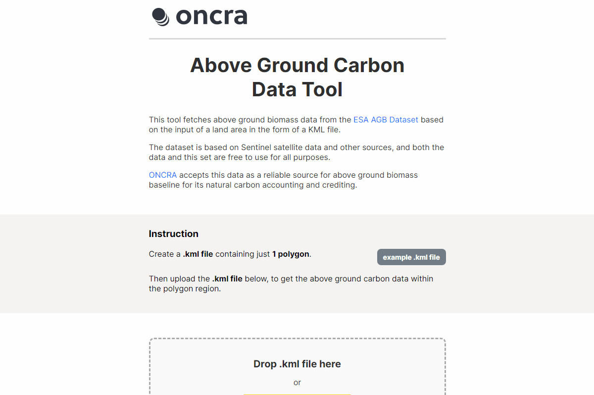

# ONCRA - Above Ground Carbon Data Tool

This tool fetches above ground biomass data from the 
[ESA AGB Dataset](https://data.ceda.ac.uk/neodc/esacci/biomass/data/agb/maps/v4.0) 
based on the input of a land area in the form of a KML file.

Website is hosted at https://oncra.github.io/

Coded with ❤️ by [@iamfranco](https://github.com/iamfranco)



## Development Setup 
First, install [node](https://nodejs.org/en) and [npm](https://docs.npmjs.com/downloading-and-installing-node-js-and-npm)

Then install the relevant project dependencies:
```
npm i
```

### To run the page locally, run:
```
npm run dev
```


### To deploy to GitHub Pages, run the command:
```
npm run deploy
```
so that it'll be deployed to a new branch `gh-pages`.
